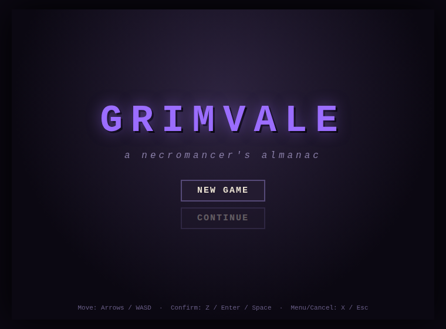
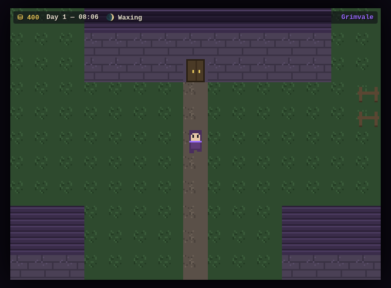
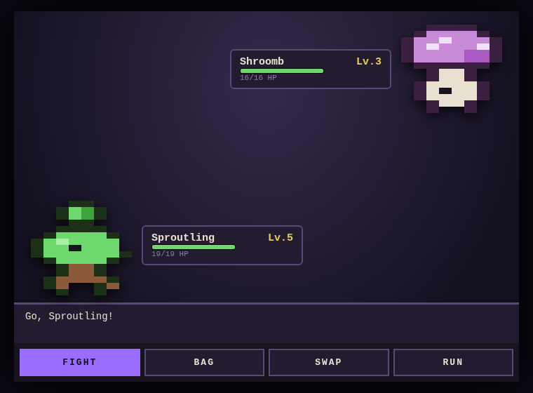
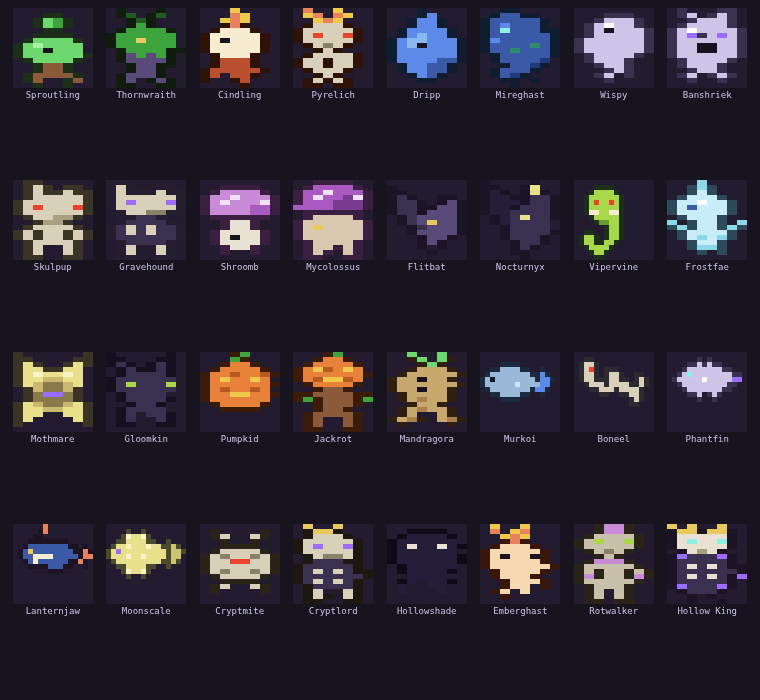

# GRIMVALE — a necromancer's almanac

A complete creature-collector RPG that runs entirely in your browser. No build
step, no dependencies, no asset files — **every sprite, tile, and creature is
generated from code**. Your save lives in your browser (localStorage).



You inherit Hollow Manor: one good room, four ruined ones, six soil plots, and
a remarkable amount of fog. Bind wild **grims** into soul jars, grow monsters
in your garden, fish ghost-fish out of cursed lakes, restore your haunted
manor, climb the endless Soul Ladder, and descend a catacomb that has no
bottom.

## Play

Open `index.html` in any modern browser. That's it.

(Or serve it: `npx serve .` / `python3 -m http.server` and open the URL.)

Combat is **real-time action-RPG**, not turn-based: your bound grims fight
beside you as a living pack while you move freely, swing your staff, hurl hex
bolts, and throw soul jars to capture weakened enemies — all on the overworld
map.

### Controls

| Key | Action |
|---|---|
| WASD / Arrows | Move freely (8-directional) |
| Z | Staff melee · or interact when facing an NPC/object |
| X | Hex bolt (ranged, costs Soul, auto-aims) |
| C | Throw a soul jar at the nearest weakened enemy (capture) |
| Esc / Enter | Pause menu (pack, satchel, gear, skills, deeds, grimdex) |
| In menus | Arrows move · Z confirm · X / Esc back |

## What's in the box

 

- **32 original grims** across 11 types (Spirit, Shadow, Bone, Flora, Fungus,
  Ember, Frost, Venom, Drowned, Moon...), with evolutions and a Grimdex to fill.
- **Real-time horde combat** — amass a pack of up to 9 grims (cap grows with
  Necromancy) that fight enemies live on the map. Each species has a combat
  archetype (chaser, swift wisp, ranged spitter, heavy tank, volley caster).
  Type effectiveness still applies. Weaken an enemy below a third, then throw a
  soul jar (3 tiers) to bind it into your pack.
- **PoE-style gear** — staves, robes, and charms drop from kills and chests
  with random affixes at three rarities (common / cursed / eldritch). Equip,
  unequip, or salvage for gold.
- **Buildable real estate** — beyond the manor, **9 deed plots** across the
  valley, each with its own location buff, upgradeable camp → cottage → hall.
- **5 player skills with NO level cap** — Necromancy, Fishing, Farming,
  Brewing, Delving. Every level grants real bonuses and gates new content
  (rods, seeds, recipes, deeper descents).
- **Farming** — grow crops for brewing... and plant *monster seeds* that hatch
  living grims. Your Farming level decides how strong they hatch.
- **Fishing** — a timing minigame at any water tile. Some fish bite only at
  night; the rarest only under a NEW or FULL moon (sleep to pass days).
- **Housing, two tiers of it** — first restore the manor's four ruined wings
  (kitchen → cauldron brewing, study → +15% XP, conservatory → fast indoor
  plots, crypt → reward chest) as a **tutorial**. Finishing it unlocks the
  **Deed Book**: buy land at SALE posts all over the valley and build it up.
  Each location does something different — Hunter's Cabin (pack XP), Lakeside
  Pier (rare fish), Graveyard Ossuary (start catacomb dives deeper), Square
  Townhouse (shop discount + daily rent), Moonhill Tower (capture + brewing),
  and more. Every house has its own interior you can decorate with furniture.
- **A chain of overworld zones, each strictly tougher** — Murkwood (Lv.2-5)
  → Gravefen → Hollow Hills → Mirkfall → Ashreach → Frostmere → The Pale
  Summit (Lv.42-50, where the Hollow King roams wild). Fixed difficulty per
  zone, no level scaling: gear up or turn back.
- **Resource gathering** — chop gnarled trees, quarry stone heaps, crack
  wisp-stones for ectoplasm, and mine iron/silver/moon ore veins (gated by
  the new endless Gathering skill). The shop's forge hammers 3 ore into
  random gear. Three frontier deed plots join the housing roster.
- **Endless catacombs** — procedurally generated floors that scale forever,
  richer chests the deeper you go, and a guardian to bind every 5th floor.
  The Hollow King waits at B25. The stairs keep going.
- **The Soul Ladder** — duel an infinite ranked ladder of rival necromancers
  whose teams scale without limit. A wandering rival also prowls Murkwood daily.
- **Day/night and moon phases** — encounters, fish, and crops all care what
  time it is.



## Development

Plain ES2020, no framework. Load order: `data → sprites → ui → world →
battle → systems → main`.

```
node test/smoke.js   # headless data/map/mechanics integrity tests
```
